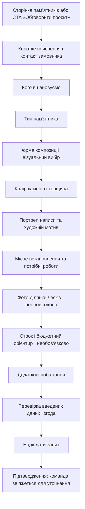

# Шлях клієнта: запит на пам’ятник

Чернетка маршруту для майбутньої покрокової Google-форми. Спочатку фіксуємо побажання клієнта; остаточні розміри, матеріал, строки та вартість підтверджуються після консультації.

## Послідовність

## Екрани форми — що за чим

| № | Крок / заголовок для клієнта | Що запитати | Обов’язковість і логіка |
|---:|---|---|---|
| 0 | **Підготуємо попередній запит** | Коротко пояснити: форма збирає побажання, це ще не замовлення з фіксованою ціною. | Інформаційний екран. Орієнтир часу — 3–5 хвилин. |
| 1 | **Як із вами зв’язатися?** | Ім’я замовника; номер телефону; зручний час для дзвінка; бажаний спосіб зв’язку (дзвінок / месенджер). | Ім’я й телефон обов’язкові. Час і канал — необов’язкові. |
| 2 | **Кого хочете вшанувати?** | Ім’я так, як воно має бути написане; дати життя, якщо вже відомі; короткий коментар. | Не блокувати форму, якщо дати чи точне написання ще уточнюються. |
| 3 | **Який тип композиції розглядаєте?** | Одинарна; подвійна; сімейний комплекс; поки не визначилися. | Одна відповідь. «Не визначилися» веде далі без додаткових запитань. |
| 4 | **Оберіть форму, яка вам близька** | 1) одинарна вертикальна стела; 2) одинарна горизонтальна; 3) подвійні вертикальні стели; 4) подвійна горизонтальна композиція; 5) сімейний комплекс; 6) індивідуальний задум / ескіз. | Показати відповідне зображення біля кожної відповіді. Одна основна форма + «ще розглядаю варіант» за потреби. Не називати картки готовими моделями. |
| 5 | **Який камінь і відтінок вам подобається?** | Чорний, сірий або червоний граніт; товщина 7 / 7,5 / 8 / 8,5 / 9 см; «потрібна порада». | Одна бажана товщина. Колір — один основний і необов’язковий альтернативний. Додати примітку: фото лише орієнтовне, фактичний відтінок узгодити за фізичним зразком. |
| 6 | **Що передбачити в оформленні?** | Портрет (так / ні / вирішимо пізніше); ім’я й дати; пам’ятний напис або епітафія; мотив (квіти, природа, символ, захоплення, український орнамент, свій варіант); інші деталі. | Усе, крім бажаного типу напису, можна залишити порожнім. Пояснити, що макет перевірять до виконання. |
| 7 | **Де буде встановлення?** | Область, населений пункт і кладовище; чи потрібні встановлення та/або благоустрій; що вже відомо про ділянку. | Населений пункт обов’язковий для виїзної оцінки; назва кладовища й опис — якщо відомі. |
| 8 | **Додайте фото або ескіз, якщо вони є** | Фото місця; приклад форми чи оформлення; ескіз; оригінал портрета можна передати пізніше. | Необов’язково. Якщо завантаження файлів у формі створює зайву перешкоду, дати варіант «Надішлю пізніше у відповідь на дзвінок/повідомлення». |
| 9 | **Коли плануєте повернутися до цього питання?** | Бажаний період; необов’язковий бюджетний діапазон або «поки не визначився». | Необов’язково; без готових цінових обіцянок. |
| 10 | **Що ще важливо врахувати?** | Вільне поле для контексту, питань і побажань. | Необов’язково. |
| 11 | **Перевірте запит** | Короткий огляд контактів, типу, форми, каменю, тексту й місця; можливість повернутися та виправити відповіді. | Перед відправленням показати основні відповіді зрозуміло, не зводити все в одне технічне поле. |
| 12 | **Надіслати запит** | Підтвердження коректності контактного номера та згода на зв’язок щодо цього запиту. | Перед публікацією форми додати узгоджене посилання на політику приватності й текст згоди на обробку даних. |
| 13 | **Запит отримано** | Підтвердити надсилання й пояснити наступний крок: команда зв’яжеться, уточнить дані й домовиться про консультацію. | Не обіцяти строк відповіді, доки команда його не підтвердить. Дублювати контактний канал лише якщо його налаштовано. |

## Правила переходів

- Тип композиції, форма, камінь і товщина — окремі кроки. Не змішувати всі рішення на одному екрані.
- Для одиночного типу показати одинарні форми; для подвійного — подвійні форми; сімейний комплекс і індивідуальний задум лишити видимими як окремі варіанти.
- Вибір «ще не знаю» має дозволяти продовжити форму, а не змушувати клієнта вгадувати технічну відповідь.
- Якщо клієнт обрав «індивідуальний задум», попросити необов’язково описати або додати ескіз.
- Якщо обрано портрет, попросити підтвердити, що фото можна надати пізніше; не вимагати завантаження портрета під час першого звернення.
- Відповіді зберігаємо окремими колонками електронної таблиці: замовник, контакт, людина, тип, форма, камінь, товщина, оформлення, локація, роботи, файли, строк, бюджет, коментар, дата звернення.

## Текст для першого екрана

**Заголовок:** Розкажіть, яким ви бачите місце пам’яті
**Пояснення:** Відповіді допоможуть підготуватися до розмови. Якщо чогось ще не знаєте — пропустіть це питання, ми уточнимо під час консультації.
**Кнопка:** Почати запит

## Текст після надсилання

**Запит отримано**
Дякуємо. Ми переглянемо ваші побажання та зв’яжемося за вказаним номером, щоб уточнити деталі.

## Що треба узгодити перед створенням Google-форми

1. Який номер/месенджер і години зв’язку вказувати як офіційні.
2. Який типовий час відповіді команда реально може виконувати.
3. Текст політики приватності та згоди для контактних і меморіальних даних.
4. Чи потрібне завантаження фото/ескізу у формі, чи краще приймати їх після першої розмови.
5. Чи потрібен бюджетний діапазон і які саме діапазони підтверджені командою.

Цей маршрут є структурою майбутньої форми, а не опублікованою Google-формою.
